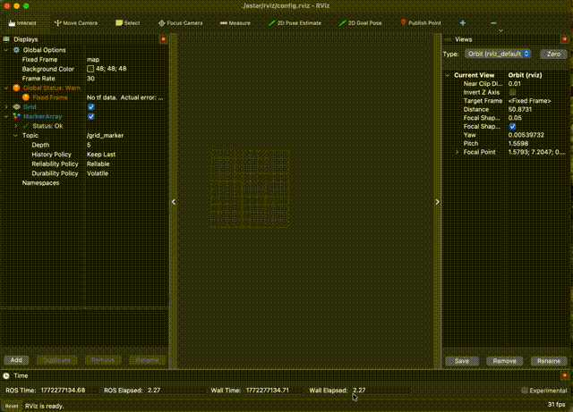

# A* Pathfinder with RViz2 Visualization

A ROS2 (Humble) package that runs A* pathfinding on a 2D grid and animates the search in real time using RViz2 visualization markers.

  

---



The algorithm spreads across the grid cell by cell, visualizing the open set (yellow), closed set (blue), obstacles (red), and the final path (green) once the goal is reached.

| Color | Meaning |
|-------|---------|
| ⬜ White | Start |
| 🟧 Orange | Goal |
| 🟥 Red | Obstacle |
| 🟨 Yellow | Open set (being considered) |
| 🟦 Blue | Closed set (already explored) |
| 🟩 Green | Final path |

---

## Architecture

The project is intentionally structured to separate algorithm logic from ROS2 concerns — a pattern common in production robotics code.

```
astar/
├── include/astar/
│   ├── grid.hpp        # Pure data structures — Cell, Grid, CellState (no ROS2)
│   └── astar.hpp       # Step-wise A* algorithm (no ROS2)
├── src/
│   └── astar_node.cpp  # ROS2 node — owns state, drives algorithm via timer
├── launch/
│   └── astar.launch.py # Configurable launch with goal parameters
└── rviz/
    └── astar.rviz      # Pre-configured RViz2 layout
```

### Key design decisions

- `grid.hpp` and `astar.hpp` have zero ROS2 dependencies — they can be tested independently
- A* runs **one step per timer tick** rather than all at once, enabling real-time animation
- The node owns `open_set_` and `closed_set_` as member variables, passed by reference into `step_astar()`
- Parent coordinates stored in each `Cell` struct rather than raw pointers, avoiding dangling pointer issues on vector reallocation

---

## Dependencies

- ROS2 Humble
- `rclcpp`
- `visualization_msgs`
- `geometry_msgs`

---

## Build

```bash
cd ~/your_ws
colcon build --packages-select astar --symlink-install
source install/setup.bash
```

---

## Run

```bash
# Default start (1,1) → goal (17,19)
ros2 launch astar astar.launch.py

# Custom goal
ros2 launch astar astar.launch.py goal_x:=10 goal_y:=10
```

---

## How A* Works

A* selects the next cell to explore using:

```
f(n) = g(n) + h(n)
```

- `g(n)` — actual cost from the start (number of steps taken)
- `h(n)` — Manhattan distance heuristic to the goal
- `f(n)` — combined score; lowest f is always explored next

This biases exploration toward the goal rather than spreading equally in all directions like BFS, making it significantly more efficient on open grids.

---

## Extending

To add your own obstacles, edit the constructor in `astar_node.cpp`:

```cpp
grid_->set_obstacle_rectangle(x0, y0, x1, y1);
```

Grid size is currently hardcoded to 20×20. Parameter support for grid size and obstacle configuration is a planned extension.
